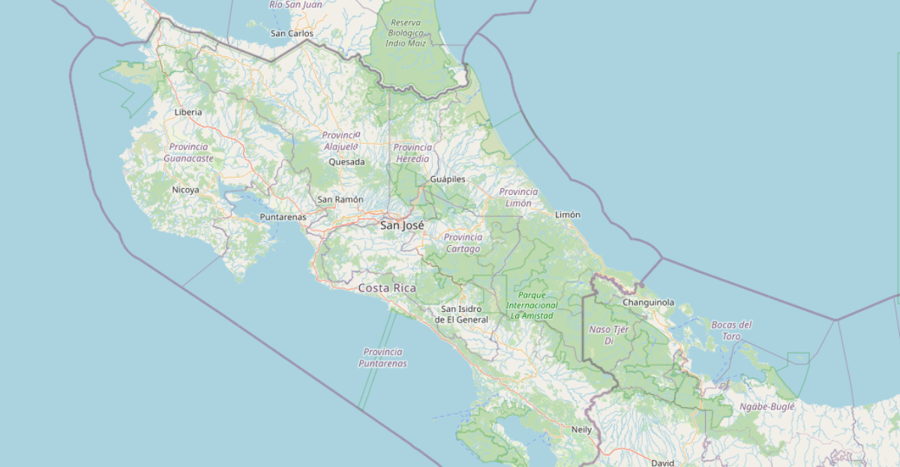
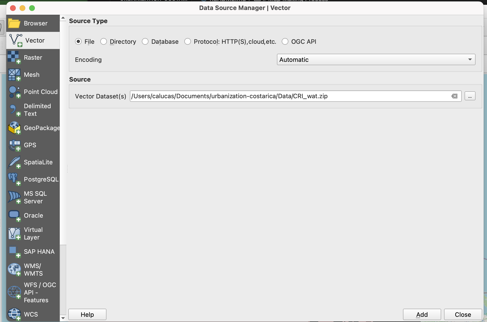
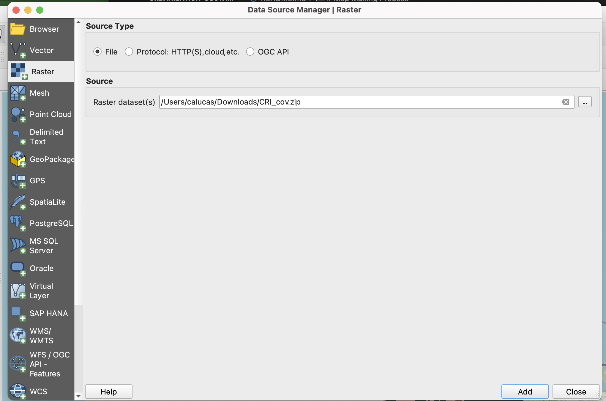
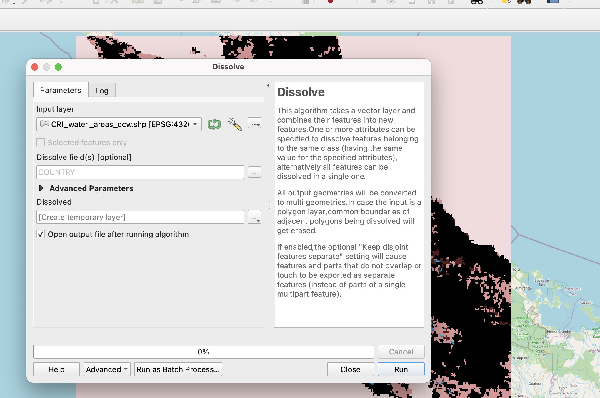

# Urbanization in Costa Rica

Defining space we have occupied from wildlife in Costa Rica.

# Introduction 

For my project, I decided to look at area taken up by human population in Costa Rica. Costa Rica is a location known for it's abundant wildlife, beautiful beaches, and amazing rainforests. Tourism is high in the area for all of those reasons. However, much of the rainforest is now becoming urbanized due to population growth and catering to tourists. There is an overwhelming amound of habitat fragmentation causing problems for wildlife. If you want to learn more about urbanization for wildlife, specifically two and three-fingered sloths, please go to the Sloth Conservation Foundation website linked below. 

[Link to Sloth Conservation Foundation](https://slothconservation.org/urban-sloth-project-the-impacts-of-habitat-disturbance/)

# Data Source 

I downloaded data from Texas A&M University's online library. There were several different maps about Costa Rica on website. I used maps that showed the water areas, water lines, land coverage, population, as well as OpenStreetMap. The projection of the original data was EPSG 4326-WGS 84. 

[Link to Costa Rica Data Set](https://tamu.libguides.com/c.php?g=439384&p=2994027)

# Map Making Process

Start with adding OpenStreetMap into QGIS. I zoomed into focus on Costa Rica but you can also use the coordinates -9355433, 1109152 that are for San Jose. 

*OpenStreetMap of Costa Rica*

After downloading my base maps to my folder in documents, I added each one to my map. For the water lines and water area data, I went to Layers-> Add Vector Layer. 

Below you can see the Water Lines and Water Area basemaps added to the map.

*Water Lines running throughout Costa Rica*

*Water Areas throughout Costa Rica*

For the land cover and poplation data, I went to Layers-> Add Raster Layer.

*Land Cover of population use in Costa Rica*

Next, I went to Vector-> Geoprocessing Tools-> Dissolve to layer my water areas with my land cover and population data. 

*Image looks very similar to before*

My ending projection was EPSG 3857, WGS 84/Pseudo-Mercator, and scale 1:1500000.

# Map Summary

In order to understand the space taken up, I wanted to show how the population has gotten closer to living near water areas which are hot spots for wildlife. Over the years, we have taken to major deforestation and building roads right through rainforests. Unforunately, it is hard to tell by looking at my maps how much space we now occupy vs how much we used to. It would've benfitted from data taken years ago to put it up against. Also, dissolve may not have been the best geoprocessing tool to use. 

# Link to Final Project

[Final Project Website](https://calu233.github.io/urbanization-costarica/)
